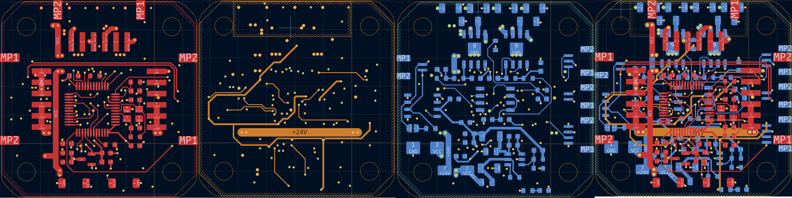

# pcb-layout-design Skill

用于原理图设计和封装分配完成后的 PCB 布局、走线、铺铜、设计评审与投板准备。入口是 [SKILL.md](SKILL.md)，Agent 会根据任务按需读取 `references/` 中的专题规则。

## 从 PCB 工程中使用

Skill 目录结构示例，实际存放位置不限：

```text
pcb-layout-design/
├─ SKILL.md
└─ references/
   ├─ pcb-layout-design-guidelines.md
   ├─ layout-and-mechanics.md
   ├─ stackup-return-power.md
   ├─ signal-and-interface.md
   ├─ routing-geometry-and-coupling.md
   ├─ manufacturing-and-kicad.md
   ├─ review-checklists.md
   ├─ k230d-case-study.md
   └─ k230d/
      ├─ layout_inventory.json
      └─ layer_overview.png
```

使用绝对路径指定 Skill 时不需要先安装。使用步骤如下：

1. 在要设计的 PCB 工程根目录打开 Codex，确认 Agent 可以读取实际存放 Skill 的目录。
2. 在指令中写明实际 `SKILL.md` 的路径。Agent 将根据任务选择需要的专题文档，无需手工列出全部 `references`。
3. 第一次接手工程时，建议先做只读检查，确认根工程、PCB 版本、已有设计规则、板框、固定结构件、叠层和缺失输入。
4. 检查结果明确后，再要求执行布局、走线、整理或投板准备，并说明允许修改的范围。
5. 完成后查看 Agent 报告的修改文件、原生 DRC/未连接检查、未验证项和阻断问题。

以下指令中的 `<SKILL.md 的实际路径>` 是占位符，使用时替换为自己的 Skill 路径。第一次检查可以发送：

```text
请读取并遵循 <SKILL.md 的实际路径>，按需读取它引用的参考文档。

检查当前 KiCad 工程是否具备开始 PCB 布局的条件；列出已有约束、缺失输入和需要处理的问题，本次只审查，不修改工程。
```

需要实际修改时，推荐按照下面的结构说明任务：

```text
请读取并遵循 <SKILL.md 的实际路径>，按需读取它引用的参考文档。

目标：<完成布局 / 继续走线 / 整理指定区域 / 局部优化 / 投板准备>
范围：<全板，或明确的器件、网络、功能模块和区域>
必须保持：<已确认板框、固定接口、安装孔、天线净空、叠层和其他基线>
制造条件：<板厂、层数/叠层、铜厚及已有规则；未知项写待确认>
修改权限：<允许修改 PCB；是否允许调整普通器件；是否只审查>
完成要求：<需要执行的 DRC、未连接、填铜、关键网络或输出检查>
```

只填写当前任务相关的信息；已有工程记录能够确认的内容无需重复提供。例如：

| 任务   | 示例指令                                               |
| ---- | -------------------------------------------------- |
| 完成布局 | 按这个 Skill 完成器件布局，保持已人工确认的板框、接口和结构件，并检查可布线性。        |
| 继续走线 | 按这个 Skill 继续走线和铺铜；边拉线边优化可移动器件布局，每组关键网络完成后复核。       |
| 整理走线 | 按这个 Skill 整理指定区域的散乱走线，先检查整组通道，再处理转角和进出线；保持电气与机械约束。 |
| 局部优化 | 按这个 Skill 优化指定电源或接口区域，并完成受影响网络、参考面和铜区的关联检查。        |
| 设计审查 | 按这个 Skill 审查当前 PCB，按严重度列出可定位的问题、依据和建议，不修改工程。       |
| 投板准备 | 按这个 Skill 检查最终 PCB，并生成和核对要求的制造、钻孔及装配资料。            |

制造厂、叠层、结构基线、任务范围和是否允许修改等条件应在指令中明确；已有确认可以直接复用。

## 安装为可发现的 Skill

复制整个 `pcb-layout-design` 文件夹，保留 `SKILL.md` 和 `references/`：

- 默认个人目录：`%USERPROFILE%\.codex\skills\pcb-layout-design`
- 设置了 `CODEX_HOME` 时：`%CODEX_HOME%\skills\pcb-layout-design`

安装后可在 Codex 中选择 `pcb-layout-design`，或调用：

```text
$pcb-layout-design
请检查当前 KiCad 工程并继续 PCB 布局与走线。制造采用嘉立创，复用已确认的板框、叠层和设计规则。
```

如果新安装的 Skill 尚未显示，重新启动当前 Codex 会话后再检查可用 Skill 列表。

## 文件导航

- [SKILL.md](SKILL.md)：任务范围、核心约束和执行流程。
- [设计规范导航](references/pcb-layout-design-guidelines.md)：统一原则和专题加载入口。
- `references/*.md`：布局机械、叠层电源、信号接口、制造规则、走线几何和评审清单。
- [K230D 案例](references/k230d-case-study.md)：案例观察和学习记录；其中参数不能直接作为其他 PCB 的规则。

## Layout 示例



## 注意 !!!

将 SKill 安装或放到 .codex 目录下使用的时候将本 README.md 和 Docs/ 删除，因为 README 的存在会导致 codex 不识别 SKill。
